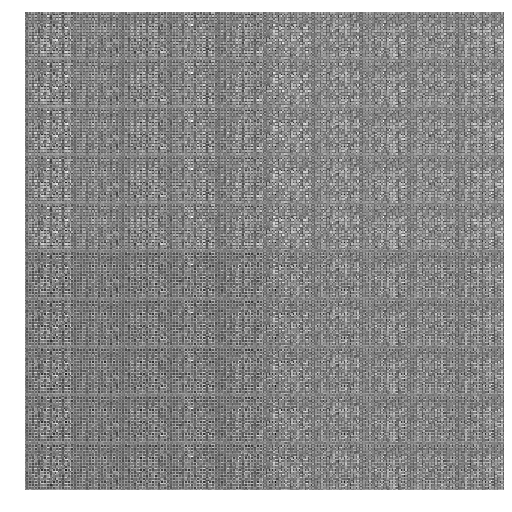

# Conditional GANs

## paper

[Conditional Generative Adversarial Nets](https://arxiv.org/abs/1411.1784)

## Requirement

```
tensorflow == 1.3.0
matplotlib
numpy
```

## Usage

### Run

```bash
python main.py
```

### Make gif

```bash
cd ./result
# in our code, last_sample_id is 57
convert -delay 10 -loop 0 {0..last_sample_id}.png mnist.gif
```

## Result


