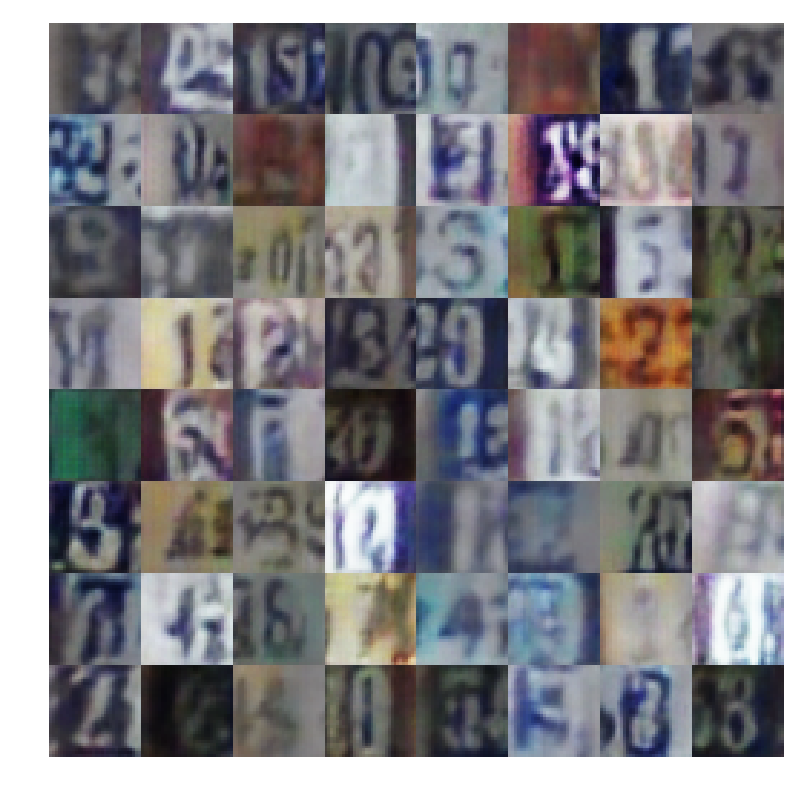

# WassersteinGAN with Gradient Penalty

**Declaration:** This tensorflow implementation of WGAN  with gradient penalty is modified from [(Zardinality/WGAN-tensorflow)](https://github.com/Zardinality/WGAN-tensorflow)

## Paper
[Improved Training of Wasserstein GANs](https://arxiv.org/abs/1704.00028)


## Requirement
```
tensorflow == 1.3.0
matplotlib
numpy
```

## Usage

### run
```
python main.py
```

### mode selection
```python
if __name__ == '__main__':
    main(mode='train') # training mode
    # main(mode='test') testing mode
```

### dataset selection
```python
# dataset name, support [mnist, celeba, svhn]
dataset_name = 'mnist'
```

### parameters
```python
# batch size
batch_size = 64
# noise dimensions
z_dim = 128
# learing rate
learning_rate_c = 1e-4
learning_rate_g = 1e-4
# image width and height
image_width = 32
image_height = 32
# kernel numbers
ndf = 32
ngf = 32
# critic update per step
Critics = 5
# gradient penalty coefficient
lam = 10
# adam parameters
beta1 = 0.5
beta2 = 0.9
# max iteration steps
max_iter_step = 20000
# image channels
channels = 1 if dataset_name == 'mnist' else 3
# tensorflow summary log path
log_path = './' + dataset_name + '/log_wgan'
# checkpoint path
ckpt_path = './' + dataset_name + '/ckpt_wgan'
ckpt_step_path = ckpt_path + '.step'
```

## Result

| Dataset  |          sample0           |          sample1           |          sample2           |
| :------: | :------------------------: | :------------------------: | :------------------------: |
| `mnist`  |   |   |   |
|  `svhn`  |    |    |    |
| `celebA` |  |  |  |
